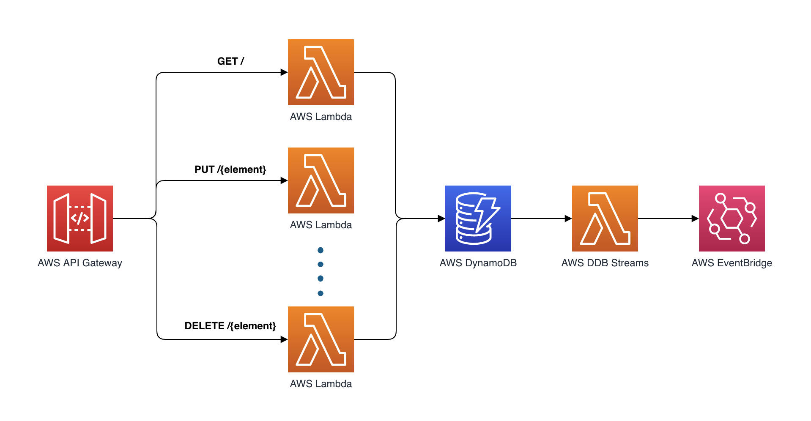

## Trust Registry
> Enabling the interoperability layer between multiple roots of trust.


This is serverless service built in Rust. It consists of an API Gateway backed by Lambda functions and a scalable database for policy storage. It uses an Hexagonal Architecture pattern to decouple the [entry points](./src/entrypoints/), from the main [domain logic](./src/lib.rs), the [storage component](./src/store), and the [event bus component](./src/event_bus).

## High-level architecture
This is a high-level view of how the different components interact with each other.

<p align="center">
  
</p>

## Deployment and testing

### Requirements

* [Rust](https://www.rust-lang.org/) 1.56.0 or higher
* [cargo-lambda](https://github.com/calavera/cargo-lambda)
* [Zig](https://ziglang.org/) for cross-compilation (cargo-lambda will prompt you to install it if it's missing in your host system)
* The [AWS SAM CLI](https://docs.aws.amazon.com/serverless-application-model/latest/developerguide/serverless-sam-cli-install.html) 1.33.0 or higher for deploying to the cloud
* [Artillery](https://artillery.io/) for load-testing the application

### Commands

You can use the following commands at the root of this repository to test, build, and deploy this project:

```bash
# Optional: check if tools are installed
make setup

# Run unit tests
make tests-unit

# Compile and prepare Lambda functions
make build

# Deploy the functions on AWS
make deploy

# Run integration tests against the API in the cloud
make tests-integ

# Run load test
make tests-load

# Run load tests report
make tests-load-report
```

## License

This library is licensed under the MIT-0 License. See the LICENSE file.

